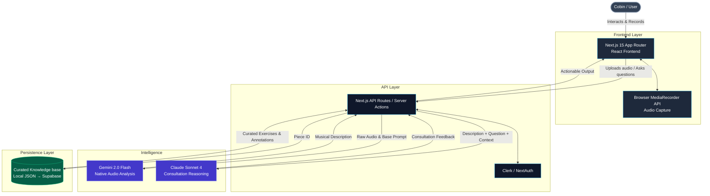

# AI Music Coaching Consultant - Tech Stack

This document visualizes the proposed technology stack for the AI Music Coaching Consultant system, designed as a lightweight, 2026-ready architecture requiring no DSP setup.

## Architecture & Integration Flow

## Stack Details

| Layer | Choice | Rationale |
| --- | --- | --- |
| **Frontend Framework** | Next.js 15 (App Router) | Easy API routes and robust audio/file handling handling at the edge. |
| **Audio Capture** | Web `MediaRecorder` API | Zero dependencies, works natively across all modern browsers. |
| **Audio Understanding** | Gemini 2.0 Flash | Accepts native audio input, removing the need for custom DSP or Whispers. |
| **Consultation Logic**| Claude Sonnet 4 | The best instructable reasoning available for complex musical reflection. |
| **Knowledge Layer** | JSON (Migrating to Supabase) | Starts simple and lightweight, heavily prioritizing curated data over volume. |
| **Authentication** | Clerk or NextAuth | For preserving user state. |
| **Hosting / Deploy** | Vercel | Seamless integration with Next.js architecture. |
